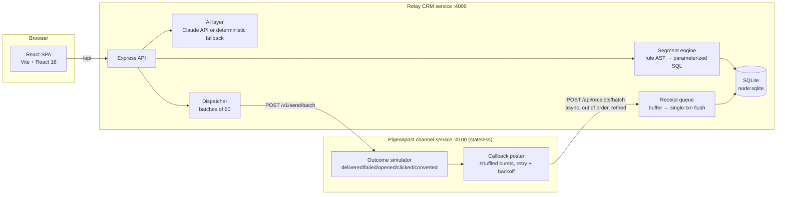

# Relay — an AI-native Mini CRM for reaching shoppers

Relay helps a consumer brand decide **who to talk to, what to say, and what happened after they said it**. It is built for the Xeno engineering take-home: a two-service, callback-driven CRM with AI woven into the three moments where a marketer actually needs help — describing an audience, drafting the message, and reading the results.

The demo brand is **Brew & Bloom**, a fictional Indian specialty coffee chain with ~600 shoppers and ~3,500 orders of realistic, seeded purchase history.

---

## The product point of view (what I chose to build, and not build)

The brief is open, so the scoping is deliberate:

**Built:**
1. **Natural-language audiences.** The marketer types *"shoppers who spent over ₹5,000 but haven't ordered in 3 months"*. The AI converts that to a structured rule set, which is previewed instantly (size + sample shoppers) before saving. The marketer always sees and can verify the rules — AI proposes, the human confirms.
2. **AI message drafting with personalization tokens.** Given the audience and a campaign objective, the AI drafts three distinct variants using `{{first_name}}`, `{{city}}`, `{{total_spend}}`, `{{last_order_days}}` tokens, respecting channel length limits. The marketer picks one, edits it, and sees a live rendered preview for a real shopper before launch.
3. **The full communication lifecycle, done properly.** A separate channel service ("Pigeonpost") simulates delivery, opens, clicks and conversions, and calls back asynchronously — out of order, in bursts, with retries. The CRM ingests receipts idempotently and the campaign page shows the funnel updating live, including **revenue attributed to the campaign** (a CONVERTED receipt creates a real, attributed order).
4. **AI campaign insight.** One click turns raw funnel numbers into a short narrative with benchmarks — what worked, what underperformed, what to try next.

**Deliberately not built:** multi-user auth, A/B testing infrastructure, scheduling, real channel integrations, email template builders. Each would dilute the core loop. The depth went into the part the assignment flags as the real evaluation surface: the asynchronous receipt loop.

---

## Architecture



**The callback loop in one paragraph:** Launching a campaign writes every communication as `QUEUED` in a single transaction, then dispatches batches of 50 to the channel service, marking them `SENT` on a `202`. The channel simulates a realistic funnel (≈8% fail, ≈92% deliver; ≈55% of delivered open; ≈28% of opens click; ≈30% of clicks convert with an order amount), buffers receipts, **deliberately shuffles them out of order**, and posts them back in bursts with up to 5 retries and exponential backoff + jitter. The CRM acks every receipt batch with a `202` immediately, buffers in memory, and flushes every 400ms in one transaction.

### How volume, ordering, retries, and failures are handled

| Concern | Mechanism |
|---|---|
| **Volume** | Receipts are never written one-by-one. They're acked instantly, buffered, and flushed in a single transaction every 400ms — the write amplification of thousands of callbacks collapses into a few batched transactions. Dispatch is likewise batched (50/call, channel caps at 200). |
| **Ordering** | Receipts arrive shuffled by design. State transitions are **monotonic**: guarded `UPDATE`s ensure a late-arriving `SENT` can never undo a `DELIVERED`, and an `OPENED` can land before its `DELIVERED` without corrupting the funnel. |
| **Retries / duplicates** | The channel retries failed callbacks (5 attempts, expo backoff, 30s cap), so the CRM **must** be idempotent. Every receipt carries an `event_id`; an `INSERT OR IGNORE` ledger (`receipt_events`) makes replays no-ops — verified in e2e by replaying a CONVERTED receipt and confirming attributed revenue does not double-count. |
| **Failures** | A whole-batch dispatch failure marks those communications `FAILED` with a reason rather than leaving them stuck in `QUEUED`. Channel-side callback failures are retried; after exhaustion they're dropped (acceptable at this scope — see tradeoffs). |

### Explicit tradeoffs (what I'd do at scale vs. what I did here)

- **SQLite (`node:sqlite`) instead of Postgres.** Zero native deps, zero infra, transactional, perfect for a single-node demo. At scale: Postgres, with the receipt ledger as a unique-constrained table and funnel counters maintained via triggers or a materialized rollup.
- **In-memory receipt buffer instead of a queue.** A process crash between ack and flush loses ≤400ms of receipts. At scale: the receipt endpoint writes to SQS/Kafka and a consumer does the batched, idempotent apply — same logic, durable transport.
- **Polling instead of websockets** for the live campaign page (2s). Simpler, stateless, good enough at this volume; at scale I'd push deltas over SSE/websockets.
- **AI never writes SQL.** The LLM emits a constrained rule AST (`{logic, conditions:[{field, op, value}]}`) that is whitelist-validated and compiled to parameterized SQL. This kills prompt-injection-to-SQL-injection by construction and makes every AI-built segment human-inspectable.
- **Deterministic AI fallback.** Without an `ANTHROPIC_API_KEY`, a heuristic parser handles NL segmentation, templated drafting, and rule-based insight — the product is fully demoable offline, and the AI layer is a swappable seam, not a load-bearing dependency.

---

## Data model (SQLite)

- `customers` — profile, city, per-channel consent flags (`consent_email/sms/whatsapp`, enforced at launch)
- `orders` — purchase history; `source_campaign_id` links orders created by CONVERTED receipts back to the campaign (**attribution**)
- `segments` — saved rule ASTs + human-readable description
- `campaigns` — audience, channel, objective, message template, status
- `communications` — one row per recipient: `QUEUED → SENT → DELIVERED/FAILED`, plus `opened_at / clicked_at / converted_at / converted_amount`
- `receipt_events` — idempotency ledger keyed on `event_id`

---

## Running locally

Requires **Node ≥ 22.5** (uses the built-in `node:sqlite`).

```bash
npm install            # root deps (express, cors, concurrently)
npm run build          # installs web deps + builds the React app
cp .env.example .env   # optional: add ANTHROPIC_API_KEY for live AI

npm run start          # CRM on :4000 (serves built UI) + channel on :4100
# open http://localhost:4000
```

Dev mode (Vite HMR on :5173 proxying /api):

```bash
npm run dev
```

The database self-seeds on first boot (600 shoppers, ~3,500 orders across regulars, lapsed VIPs, occasionals, lapsing, and dormant archetypes — so winback/VIP segments are never empty).

End-to-end smoke test (boots both services, runs NL segmentation → save → draft → launch → receipt settlement → idempotency replay → attribution check):

```bash
npm run e2e
```

## Deploying

Two services, any Node host (Render / Railway / Fly):

1. **CRM service** — `npm install && npm run build`, start: `npm run server`. Env: `PORT`, `CHANNEL_URL=<channel public URL>`, `CRM_URL=<own public URL>`, optionally `ANTHROPIC_API_KEY`.
2. **Channel service** — start: `npm run channel`. Env: `PORT`.

The channel learns the callback URL from each send request, so `CRM_URL` must be the CRM's public address. Note SQLite is on local disk — use a persistent volume, or accept reseed-on-redeploy for the demo.

## API surface

| Method & path | Purpose |
|---|---|
| `GET /api/overview` | KPIs, recent campaigns, AI status |
| `POST /api/ingest` | Bulk ingest customers + orders |
| `GET /api/customers` | Browse shoppers |
| `POST /api/segments/preview` | NL prompt **or** rules → validated rules, description, size, sample |
| `POST / GET /api/segments` | Save / list audiences |
| `POST /api/ai/draft` | 3 message variants for audience + objective |
| `POST / GET /api/campaigns` | Launch / list campaigns |
| `GET /api/campaigns/:id` | Funnel stats, recent events, sample sends |
| `POST /api/campaigns/:id/insight` | AI narrative on performance |
| `POST /api/receipts`, `/api/receipts/batch` | Channel callback ingestion (idempotent) |
| **Channel:** `POST /v1/send`, `/v1/send/batch`, `GET /health` | Stubbed send API |

## AI-native workflow (how this was built)

The product itself uses AI at three seams (segmentation, drafting, insight), all through one constrained pattern: **AI emits structured intent, code validates and executes it.** The development workflow was equally AI-native — the architecture, the out-of-order/idempotency design, the seed-data archetypes, and the UI were built in tight loops with Claude: I directed the scoping and the system-design decisions, used AI to generate and iterate on implementation, and verified everything through the e2e harness (including adversarial cases like receipt replay and late-arriving SENT events).

---

## Walkthrough video outline (~5–6 min)

1. **Product intro (~0:30)** — "Relay helps a brand decide who to talk to, what to say, and what happened next. I scoped hard around one loop: audience → message → live lifecycle → attribution."
2. **Functional demo (~1:30)** — Type an NL audience, show the rules + preview; draft with AI, edit, show live personalization for a real shopper; launch; watch the receipt pulse stream and funnel fill in live; show attributed revenue; click AI insight.
3. **Architecture (~1:00)** — The mermaid diagram above. Emphasize: separate stateless channel, shuffled bursts + retries on purpose, idempotent batched ingestion, monotonic state machine.
4. **Code walkthrough (~1:00)** — `segmentEngine.js` (AST → parameterized SQL, why AI never writes SQL), `receiptQueue.js` (ledger + guarded updates + single-txn flush).
5. **AI-native workflow (~1:00)** — Structured-intent pattern in product; directed AI development with e2e verification in process.
6. **Close (~0:15)** — Tradeoffs slide: SQLite→Postgres, buffer→queue, polling→SSE.
